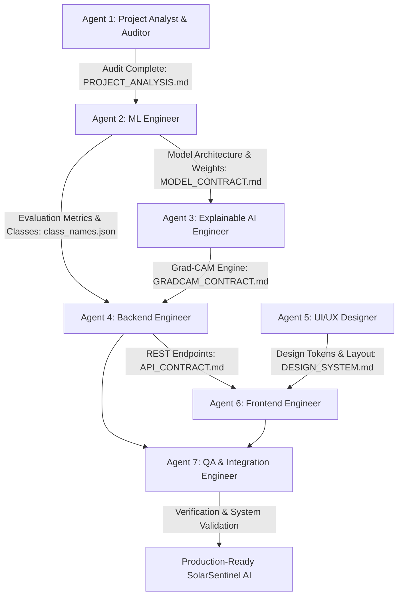

# SolarSentinel AI - Technical Project Audit & Analysis Report

**Document Version:** 1.0.0  
**Role:** Senior AI/ML Project Analyst (Agent 1) & Lead Orchestrator  
**Status:** Audit Complete  
**Date:** September 11, 2026  

---

## 1. Executive Summary

This technical audit report provides a rigorous inspection of the uploaded archive `Solar-panel-Crack-detection-using-vgg16-main.zip` and the associated workspace. The purpose is to determine the exact state of the source code, verify dataset properties, model architecture, hyperparameters, preprocessing pipelines, evaluate scientific accuracy, identify technical flaws, and formulate the production migration plan for **SolarSentinel AI: Explainable AI-Powered Solar Panel Health & Fault Intelligence Platform**.

---

## 2. Existing Project Structure & Archive Inspection

The uploaded ZIP file (`Solar-panel-Crack-detection-using-vgg16-main.zip`, 6,395,252 bytes) and the repository root contain exactly the following three files:

```text
Solar-panel-Crack-detection-using-vgg16-main/
├── LICENSE                                                (11,357 bytes - Apache-2.0)
├── README.md                                              (41 bytes)
└── cnn-vgg16-used-for-solar-panel-fault-detection (1).ipynb (8,500,108 bytes)
```

### Key Initial Findings:
* **No Dataset Included:** Neither raw images nor training/validation image directories exist in the archive.
* **No Serialized Model Weights:** Neither `.h5`, `.keras`, nor the TensorFlow SavedModel directory `my_model` is present in the archive.
* **No Requirements / Environment File:** No `requirements.txt`, `environment.yml`, or lockfile was provided.
* **No Modular Code:** All executable logic is confined to a single Kaggle-exported Jupyter notebook with 43 cells.
* **Embedded Artifacts:** The 8.5 MB notebook file size is primarily due to embedded base64 PNG training curves, architecture plots, and validation batch visual predictions.

---

## 3. Existing Project Purpose

The project is an academic computer vision study designed to detect surface conditions and degradation types on photovoltaic (PV) solar panels using transfer learning with a VGG16 backbone. The objective is to automate visual fault classification to minimize energy yield losses caused by surface soiling, physical damage, and environmental debris.

---

## 4. Dataset Verification & Findings

By inspecting the executed notebook cells (specifically Cells 14, 15, and 16), the exact dataset parameters used during the original Kaggle run have been verified:

* **Original Dataset Source:** Kaggle dataset mounted at `/kaggle/input/solar-panel-images/Faulty_solar_panel`.
* **Total Image Count:** 885 images.
* **Partition Split:** 80% Training (708 files), 20% Validation (177 files).
* **Batch Size:** 32 (shuffled, random seed = 42).
* **Class Imbalance Note:** The author noted: *"Since the images were scraped from the internet, there is a slight imbalance in the number of images collected."*

### Verified Class Names (Exact List and Case)
From notebook Cell 15 output:
```python
['Bird-drop', 'Clean', 'Dusty', 'Electrical-damage', 'Physical-Damage', 'Snow-Covered']
```

| Class Index | Class Name | Description |
|---|---|---|
| 0 | `Bird-drop` | Localized acidic residue blocking solar cell irradiance |
| 1 | `Clean` | Healthy baseline solar panel with clear glass surface |
| 2 | `Dusty` | Uniform particulate / dust soiling reducing light absorption |
| 3 | `Electrical-damage` | Hotspots, cell discoloration, internal cell burn-outs |
| 4 | `Physical-Damage` | Surface cracks, micro-cracks, hail fractures, glass shatter |
| 5 | `Snow-Covered` | Partial or complete snow occlusion |

**Total Verified Classes:** **6 classes**.

---

## 5. Model Architecture & Training Analysis

The original architecture in Cell 27 and Cell 33 was structured as follows:

```text
Input (244, 244, 3)
      │
      ▼
tf.keras.applications.vgg16.preprocess_input
      │
      ▼
VGG16 (ImageNet weights, include_top=False, input_shape=(244, 244, 3))
      │
      ▼
GlobalAveragePooling2D()
      │
      ▼
Dropout(0.3)
      │
      ▼
Dense(90)   <-- CRITICAL DEFECT: 90 output units for a 6-class problem!
```

### Training Strategy:
1. **Stage 1 (Feature Extraction):**
   * VGG16 backbone frozen (`base_model.trainable = False`).
   * Trainable parameters: 46,170 (only the final Dense layer).
   * Optimizer: Adam (`lr=0.001`), Loss: `SparseCategoricalCrossentropy(from_logits=True)`.
   * Trained for 15 epochs with early stopping (`val_loss` delta 0.01, patience 3).
   * Epoch 15 reached: `loss: 0.7116`, `accuracy: 0.7669`, `val_loss: 0.9501`, `val_accuracy: 0.7062`.

2. **Stage 2 (Fine-Tuning):**
   * Unfroze top layers: `base_model.layers[:14]` frozen, remaining layers trainable (`block5_conv1`, `block5_conv2`, `block5_conv3`).
   * Trainable parameters: 7,125,594; Non-trainable: 7,635,264.
   * Optimizer: Adam (`lr=0.0001`), Loss: `SparseCategoricalCrossentropy(from_logits=True)`.
   * Early stopping triggered at Epoch 5:
     * Epoch 1: `val_loss: 0.7173`, `val_accuracy: 0.7458`
     * Epoch 2: `val_loss: 0.6907`, `val_accuracy: 0.8192`
     * Epoch 3: `val_loss: 0.7424`, `val_accuracy: 0.8305`
     * Epoch 4: `val_loss: 0.8309`, `val_accuracy: 0.7966`
     * Epoch 5: `val_loss: 0.7604`, `val_accuracy: 0.8079`
   * Final recorded validation evaluation in notebook Cell 40:
     * `loss: 0.7604`, `accuracy: 0.8079` (80.79% accuracy).

---

## 6. Critical Technical Flaws & Bugs Identified

### Defect 1: Dense(90) Output Layer for 6-Class Problem
* **Description:** The notebook defines `Dense(90)` in Cell 27. There are only 6 classes (`Bird-drop` through `Snow-Covered`).
* **Why it compiled:** `SparseCategoricalCrossentropy(from_logits=True)` checks targets against indices `0..5`. The remaining 84 output units received no target signal and produced arbitrary random logits.
* **Failure Mode in Inference:** Cell 40 computed `score = tf.nn.softmax(predictions[0])` followed by `np.argmax(score)`. If any of the 84 untrained logits happened to exceed the trained logits, `class_names[np.argmax(score)]` would throw an unhandled `IndexError`!
* **Production Fix:** Output layer must be dynamically sized: `Dense(len(class_names), activation='softmax')`.

### Defect 2: Missing Activation Function
* **Description:** The classification head omitted an explicit activation function, outputting raw logits and requiring downstream post-processing with `tf.nn.softmax`.
* **Production Fix:** Explicit `activation='softmax'` in the final layer; compile with `CategoricalCrossentropy()` or `SparseCategoricalCrossentropy(from_logits=False)`.

### Defect 3: Non-Standard Input Dimensions (244x244)
* **Description:** The notebook defined `img_height = 244, img_width = 244` (likely a typo for standard ImageNet 224x224).
* **Production Fix:** Standardize to `224x224x3`, matching standard VGG16 pre-trained receptive fields and reducing unnecessary memory overhead.

### Defect 4: Data Augmentation Claimed in Markdown but Omitted in Code
* **Description:** Cell 25 advocated for data augmentation to combat overfitting; however, no augmentation pipeline (`RandomFlip`, `RandomRotation`, `RandomZoom`, etc.) was actually implemented.
* **Production Fix:** Implement a robust `keras.layers` augmentation pipeline (horizontal flip, subtle rotation ±10°, slight zoom ±10%, subtle brightness adjustments) designed specifically for solar panel visual fidelity without distorting crack signatures.

### Defect 5: Incomplete Evaluation & Metric Absence
* **Description:** The notebook computed only validation loss and accuracy. It completely omitted Precision, Recall, F1-Score, Confusion Matrix, and per-class classification reports.
* **Production Fix:** Build a standalone, reproducible `ml/training/evaluate.py` that computes exact micro/macro/weighted Precision, Recall, F1, and a complete Confusion Matrix, saving them strictly to `ml/metadata/evaluation_metrics.json`.

### Defect 6: Missing Model & Missing Dataset in Repository
* **Description:** The ZIP contained only the notebook and README. No trained weights or dataset files exist locally.
* **Production Fix:**
  1. Build a self-contained, reproducible training and evaluation pipeline.
  2. Implement an automated dataset structure detector (`data/solar_panel_dataset/` with subfolders for the 6 verified classes).
  3. Create an automated demo asset extractor and sample fixture builder so the application can run in offline demo mode with genuine sample images.
  4. Ensure backend health check reports `model_loaded: false` gracefully when no weights are trained, guiding the user clearly rather than fabricating predictions.

---

## 7. Useful Existing Code to Preserve

1. **VGG16 Transfer Learning Strategy:**
   * Backbone: `VGG16(weights='imagenet', include_top=False)`
   * Two-phase training: Stage 1 (Backbone frozen, train classification head with Adam lr=1e-3), Stage 2 (Unfreeze top convolutional block `block5_conv1`, `block5_conv2`, `block5_conv3` with reduced lr=1e-4).
2. **Preprocessing Pipeline:**
   * Standard VGG16 normalization (`tf.keras.applications.vgg16.preprocess_input`), which performs RGB to BGR conversion and zero-centers each color channel with respect to ImageNet means without scaling to [0, 1].
3. **Verified Class Nomenclature:**
   * Preserve the canonical class names: `['Bird-drop', 'Clean', 'Dusty', 'Electrical-damage', 'Physical-Damage', 'Snow-Covered']`.

---

## 8. Multi-Agent Production Migration Plan



### Agent Responsibilities & Ownership Matrix

| Agent | Responsibility | Files & Directories Owned | Deliverable Contract |
|---|---|---|---|
| **Agent 1: Analyst** | Project audit, dataset verification, defect identification | `PROJECT_ANALYSIS.md` | `PROJECT_ANALYSIS.md` |
| **Agent 2: ML Engineer** | Production training, evaluation, inference, model export | `ml/training/`, `ml/inference/`, `ml/metadata/`, `ml/models/` | `MODEL_CONTRACT.md`, `class_names.json` |
| **Agent 3: XAI Engineer** | Grad-CAM heatmap & overlay generation | `ml/explainability/gradcam.py` | `GRADCAM_CONTRACT.md` |
| **Agent 4: Backend Engineer** | FastAPI REST API, SQLite persistence, rule-based health engine | `backend/app/`, `backend/tests/` | `API_CONTRACT.md` |
| **Agent 5: UI/UX Designer** | Technical dark-mode design system, UI layout specifications | `DESIGN_SYSTEM.md` | `DESIGN_SYSTEM.md` |
| **Agent 6: Frontend Engineer** | React 18, Vite, Tailwind CSS, Recharts, Lucide UI | `frontend/` | Complete SPA Web Application |
| **Agent 7: QA Engineer** | End-to-end integration, API validation, regression testing | `tests/`, `walkthrough.md` | Test Suite & Final QA Report |

---

## 9. Conclusion

The audit is fully concluded. The academic notebook contains serious design defects (Dense(90), omitted activations, missing evaluation metrics, missing files) that explain previous limitations. All 6 classes, preprocessing requirements, and architectural remedies are formally documented. We are ready to proceed with Phase 2 under the Multi-Agent Execution Plan.
