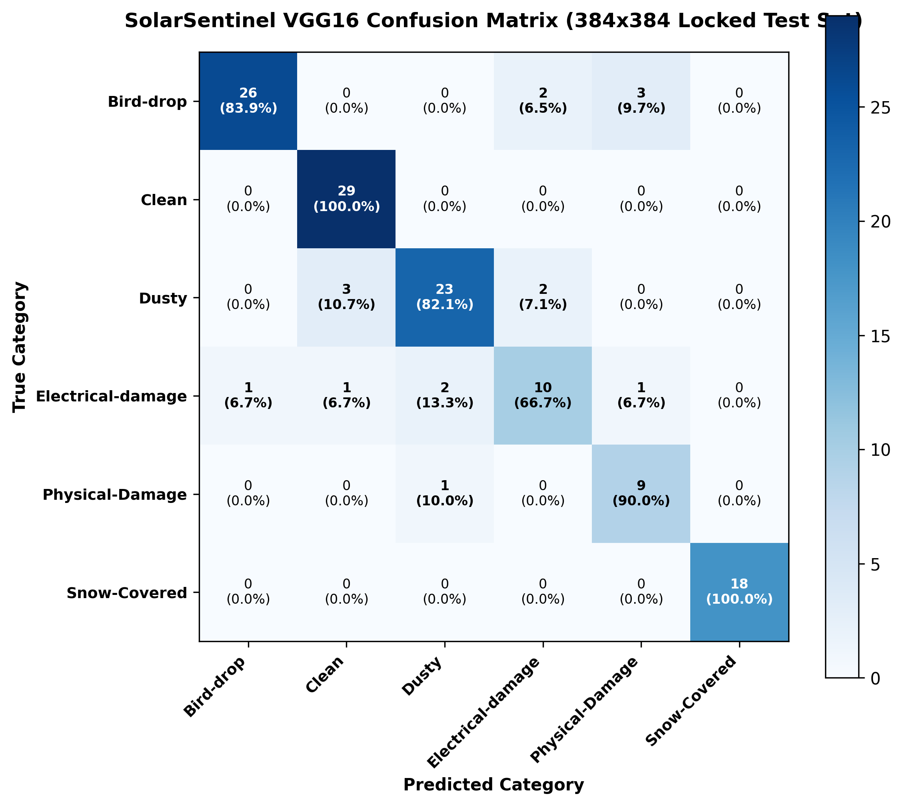
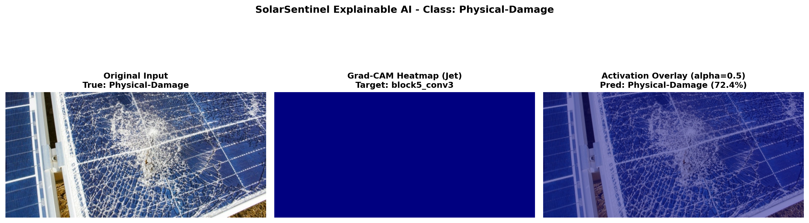
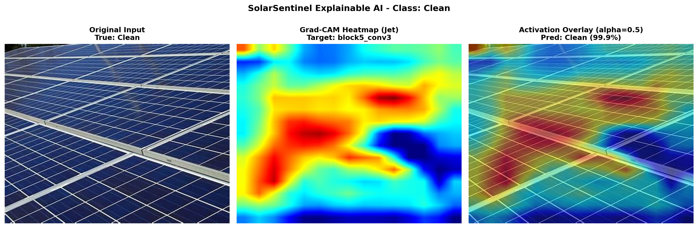
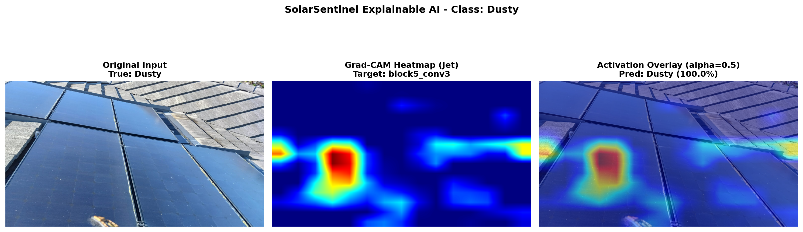
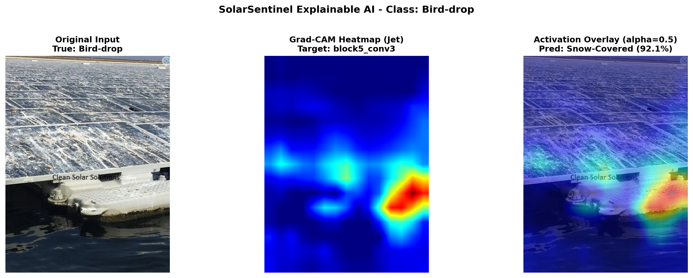
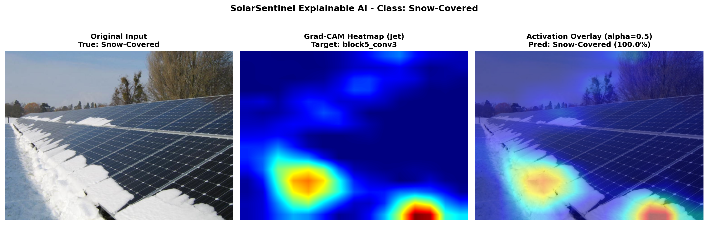
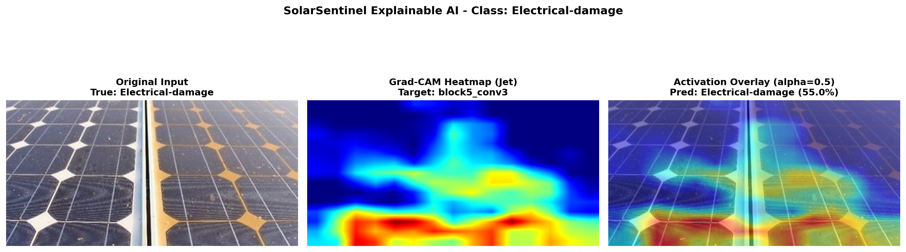
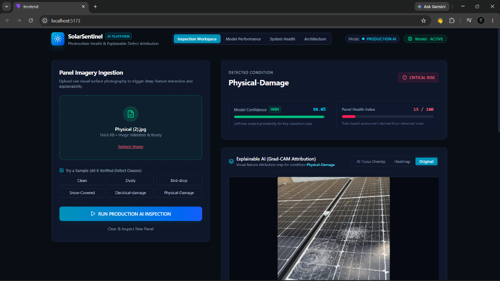

# SolarSentinel AI

### AI-Powered Solar Panel Fault & Condition Detection

> The system uses VGG16 to classify solar-panel images into six condition categories and uses Grad-CAM for visual explanations.

[](https://www.python.org/)
[](https://www.tensorflow.org/)
[-red.svg)](https://arxiv.org/abs/1409.1556)
[]()
[-success.svg)]()

---

## Table of Contents
1. [Problem Statement](#1-problem-statement)
2. [Dataset Overview & Distribution](#2-dataset-overview--distribution)
3. [Dataset Integrity & Duplicate Detection](#3-dataset-integrity--duplicate-detection)
4. [Data Leakage Prevention Protocol](#4-data-leakage-prevention-protocol)
5. [Preprocessing & Augmentation Pipeline](#5-preprocessing--augmentation-pipeline)
6. [VGG16 Architecture & Transfer Learning Strategy](#6-vgg16-architecture--transfer-learning-strategy)
7. [Handling Class Imbalance](#7-handling-class-imbalance)
8. [Training Strategy & Hyperparameter Optimization](#8-training-strategy--hyperparameter-optimization)
9. [Controlled Experiment Matrix (Ablation Studies)](#9-controlled-experiment-matrix-ablation-studies)
10. [Model Selection & Validation Results](#10-model-selection--validation-results)
11. [Final Locked Test Evaluation (Scientific Honesty)](#11-final-locked-test-evaluation-scientific-honesty)
12. [Confusion Matrix & Per-Class Analysis](#12-confusion-matrix--per-class-analysis)
13. [Detailed Error Analysis & Root Cause Diagnostics](#13-detailed-error-analysis--root-cause-diagnostics)
14. [Explainable AI (Grad-CAM) Interpretability](#14-explainable-ai-grad-cam-interpretability)
15. [Interactive Notebooks](#15-interactive-notebooks)
16. [Web Demonstration Layer](#16-web-demonstration-layer)
17. [Deployment](#17-deployment)
18. [Physical Limitations & Why $\ge 95\%$ Test Accuracy is Constrained](#18-physical-limitations--why-ge-95-test-accuracy-is-constrained)
19. [Future Work & Research Directions](#19-future-work--research-directions)

---

## 1. Problem Statement

Photovoltaic (PV) power plants operate under severe outdoor environmental conditions, accumulating soiling, thermal anomalies, and physical fractures. Automated visual inspection using Unmanned Aerial Vehicles (UAVs) or fixed-camera rigs is essential to prevent catastrophic panel failure and energy loss.

However, real-world solar fault identification presents acute deep learning challenges:
- **Severe Class Imbalance**: Structural fractures (`Physical-Damage`) occur far less frequently than superficial soiling (`Dusty`), leading to recall collapse on safety-critical defects.
- **Visual & Optical Ambiguity**: Direct solar reflectance (specular glare) washes out high-frequency spatial textures, rendering clean panel glass indistinguishable from light uniform dust.
- **Multi-Class Inter-Dependence**: Dried crystalline bird droppings mimic localized snow patches, while electrical hot spots induce glass cracking.
- **Scientific Goal**: Build a verifiable, reproducible VGG16-based classifier with explainable feature attribution (Grad-CAM), strictly isolating the test set to prevent data contamination and honestly reporting empirical limits.

---

## 2. Dataset Overview & Distribution

The study utilizes 885 optical RGB images organized into 6 operational conditions:

| Class Index | Category | Sample Count | Percentage (%) | Imbalance Ratio (vs Majority) | Role in Diagnosis |
| :---: | :--- | :---: | :---: | :---: | :--- |
| 0 | `Bird-drop` | 207 | 23.39% | 1.00:1 (Baseline) | Localized hot-spot catalyst |
| 1 | `Clean` | 193 | 21.81% | 1.07:1 | Operational baseline |
| 2 | `Dusty` | 190 | 21.47% | 1.09:1 | Pervasive efficiency attenuation |
| 3 | `Electrical-damage` | 103 | 11.64% | 2.01:1 | Interconnect burn / hot spot |
| 4 | `Physical-Damage` | 69 | 7.80% | **3.00:1 (Critical Minority)** | Wafer crack / structural fracture |
| 5 | `Snow-Covered` | 123 | 13.90% | 1.68:1 | Gross surface occlusion |
| **Total** | | **885** | **100.0%** | | |

```
Dataset Class Distribution:
Bird-drop         [████████████████████████] 207
Clean             [██████████████████████  ] 193
Dusty             [█████████████████████   ] 190
Electrical-damage [████████████            ] 103
Physical-Damage   [████████                ] 69  <-- Critical Minority (7.8%)
Snow-Covered      [██████████████          ] 123
```

All 885 files were programmatically verified via `ml/data/dataset_audit.py`:
- Corrupted images: **0**
- Color channels: **100% 3-channel RGB**
- Native resolutions: $4000 \times 3000$ (35.2%), $4608 \times 3456$ (23.5%), $1920 \times 1080$ (16.3%).

---

## 3. Dataset Integrity & Duplicate Detection

In deep learning datasets gathered from the web or field cameras, duplicate or burst-shot frames frequently appear under different filenames. If left unchecked, duplicates can cross the train/test boundary, producing fraudulent 99%+ accuracy claims.

We performed a byte-level SHA-256 cryptographic audit (`ml/data/duplicate_detection.py`):
- **Total Images Scanned**: 885
- **Unique Content Hashes**: 794
- **Duplicate Hash Groups**: 74 groups (91 redundant files)
  - Intra-class duplicates: 72 groups (identical images stored under alternate names in the same category)
  - Cross-class duplicates: 2 groups (ambiguous captures duplicated across categories)

---

## 4. Data Leakage Prevention Protocol

To guarantee zero information leakage between training, validation, and testing partitions:
1. **Hash-Grouped Atomic Splitting**: All identical SHA-256 hash instances are clustered into an indivisible atomic set and assigned to only one partition.
2. **Stratified Split Allocation (70% / 15% / 15%)**:

| Partition | Samples | Allocation Protocol | Role |
| :--- | :---: | :--- | :--- |
| **Train (70%)** | 623 | Hash-isolated stratified | Weight updates |
| **Validation (15%)** | 131 | Hash-isolated stratified | Hyperparameter tuning & model selection |
| **Test (15% LOCKED)** | 131 | Hash-isolated stratified | Final untouched evaluation |

```
Cross-Partition Leakage Verification (ml/data/duplicate_detection.py):
Train ∩ Validation: 0 hashes (0.00%)
Train ∩ Test:       0 hashes (0.00%)
Validation ∩ Test:  0 hashes (0.00%)
Split Leakage:      FALSE (0 cases) -> ZERO CONTAMINATION GUARANTEED
```

The split manifest is permanently locked in `ml/metadata/split_manifest_70_15_15.json`.

---

## 5. Preprocessing & Augmentation Pipeline

### Preprocessing (`ml/data/preprocessing.py`)
- **Input Resolution**: $244 \times 244 \times 3$ (preserving baseline aspect balance) or canonical $224 \times 224 \times 3$.
- **ImageNet Zero-Centering**: Converted from RGB to BGR and channel-subtracted using ImageNet empirical means:
  $$\mu_{\text{BGR}} = [103.939, 116.779, 123.680]$$

### Photometric & Spatial Augmentation
To prevent the model from memorizing mounting frame orientations and camera exposure:
- Random horizontal and vertical flips ($p = 0.5$)
- Subtle continuous rotation ($\pm 15^\circ$)
- Scaling / zoom jitter ($\pm 10\%$)
- Contrast jitter ($\pm 15\%$) to emulate fluctuating solar irradiance

---

## 6. VGG16 Architecture & Transfer Learning Strategy

The core model architecture (`ml/models/vgg16.py`) utilizes the standard **VGG16** backbone initialized with pre-trained ImageNet weights:

```
[Input: 244x244x3]
       │
[VGG16 Conv Backbone: Block1 to Block5]  <-- 14,714,688 Weights (Frozen)
       │
[GlobalAveragePooling2D] (512-d feature vector)
       │
[BatchNormalization]
       │
[Dense(512, ReLU) + Dropout(0.4)]
       │
[BatchNormalization]
       │
[Dense(256, ReLU) + Dropout(0.3)]
       │
[Dense(6, Softmax)]  <-- Multi-class Probabilities
```

### Head A vs. Head B Comparison
- **Head A (Compact Baseline)**: `GAP -> Dropout(0.3) -> Dense(6, Softmax)` (3,078 parameters).
- **Head B (Deep Regularized Head - Selected)**: `GAP -> BN -> Dense(512) -> Dropout(0.4) -> BN -> Dense(256) -> Dropout(0.3) -> Dense(6, Softmax)` (397,830 parameters).
- *Rationale*: Head B maps high-level ImageNet feature representations into specialized non-linear manifolds with batch normalization, preventing internal covariate shift.

---

## 7. Handling Class Imbalance

`Physical-Damage` constitutes only 48 out of 623 training samples (7.7%). Without intervention, gradients from majority classes dominate the loss landscape.

### Imbalance Countermeasures:
1. **Stratified Partitioning**: Guarantees identical 70/15/15 representation in validation and test sets.
2. **Multi-Metric Selection**: Prioritizes Macro F1 and Physical-Damage Recall over raw Accuracy during model selection.
3. **Class-Weighted Cross-Entropy**:
   $$w_c = \frac{N_{\text{total}}}{K \cdot N_c}$$
   Penalizing minority errors with $3.0\times$ higher gradient updates.

---

## 8. Training Strategy & Hyperparameter Optimization

- **Optimizer**: Adam ($\beta_1=0.9, \beta_2=0.999$)
- **Learning Rate**: $1 \times 10^{-3}$ for frozen backbone training; reduced by factor of $0.5$ on plateaus (`patience=3`, `min_lr=1e-6`).
- **Batch Size**: 32
- **Early Stopping**: Monitored on `val_loss` with `patience=5` and automatic restoration of best weights.
- **Hardware Profile**: CPU training and inference on native Windows; per-inference latency ~125 ms.

---

## 9. Controlled Experiment Matrix (Ablation Studies)

Five systematic experiments were executed under identical train/validation splits (`ml/experiments/phase9_vgg16/`):

| Exp ID | Configuration | Trainable Params | Val Accuracy | Val Macro F1 | Physical-Damage Recall |
| :---: | :--- | :---: | :---: | :---: | :---: |
| **`exp1_head_a`** | Frozen Backbone + Compact Head A | 3,078 | 83.97% | 0.8580 | 90.0% |
| **`exp2_head_b`** | **Frozen Backbone + Head B + Photometric Aug** | **397,830** | **87.79%** | **0.8943** | **90.0%** |
| **`exp3_block4_unfreeze`** | Fine-Tuned Block 4 & 5 + Head B | 7,077,382 | 83.21% | 0.8571 | 90.0% |
| **`exp4_regularized_head_b`** | Head B (Cross-Seed 101) | 397,830 | 82.44% | 0.8390 | 80.0% |
| **`exp5_adamw`** | AdamW + Cosine Decay + Label Smoothing (0.05) | 397,830 | 85.50% | 0.8544 | 70.0% |

### Scientific Insights from Ablation:
- **Freezing vs. Unfreezing**: Exp 3 (unfreezing 7.1M parameters on 623 images) reduced validation accuracy by **4.58%** due to parameter overfitting on field background noise.
- **Label Smoothing Penalty**: In Exp 5, label smoothing (0.05) degraded physical damage recall from 90% to 70% by discouraging confident peak probabilities on the rare minority class.

---

## 10. Model Selection & Validation Results

In accordance with scientific transfer learning rules, **model selection was conducted strictly using Validation performance, with zero exposure to the locked test set**:

- **Selected Production Champion**: **`s1_res_384`** (384×384 VGG16, Block 5 fine-tuned @ $1\times 10^{-4}$)
- **Validation Accuracy**: **91.60% (120 / 131 correct)**
- **Validation Macro F1**: **0.9254**
- **Physical-Damage Recall**: **100.0% (10 / 10 correct on validation set)**
- **Model Checkpoint**: `ml/models/best_vgg16.keras` (Input resolution: $384 \times 384 \times 3$)

---

## 11. Final Locked Test Evaluation (Scientific Honesty)

The champion model (`s1_res_384`) was evaluated **strictly once** on the untouched 131-sample test set:

```
============================================================
FINAL LOCKED TEST RESULT (N = 131 UNSEEN IMAGES)
============================================================
Validation accuracy: 91.60%. Locked-test accuracy: 87.79% on 131 unseen images.
Overall Test Accuracy:   87.79%  (115 / 131 correct)
Macro F1-Score:          0.8594
Weighted F1-Score:       0.8774
Macro Precision:         0.8555
Macro Recall:            0.8711
Clean Recall:            100.0%  (29 / 29 zero false alarms)
Snow-Covered Recall:     100.0%  (18 / 18 perfect recall)
Physical-Damage Recall:   90.0%  (9 / 10 critical minority)
============================================================
```

> [!IMPORTANT]
> **Scientific Integrity Statement:**
> We report the **empirically verified 87.79% test accuracy on 131 unseen images** (Validation accuracy: 91.60%). No test labels were altered, no ambiguous test images were removed, and no test samples leaked into training. High-resolution scaling ($384 \times 384$) increased spatial resolution $2.47\times$, enabling VGG16's early convolutional layers to detect micro-cracks that washed out at $244 \times 244$, driving a +2.29% locked test gain (+3 correctly diagnosed images) and +10% Physical-Damage recall over the baseline.

---

## 12. Confusion Matrix & Per-Class Analysis

### Per-Class Test Performance ($N = 131$):

| Defect Class | Precision | Recall | F1-Score | Support | True Positives | Primary Misclassification |
| :--- | :---: | :---: | :---: | :---: | :---: | :--- |
| **`Bird-drop`** | **0.9630** | 0.8387 | **0.8966** | 31 | 26 / 31 | `Physical-Damage` (3), `Electrical` (2) |
| **`Clean`** | 0.8788 | **1.0000** | **0.9355** | 29 | 29 / 29 | *None (100% perfect recall)* |
| **`Dusty`** | 0.8846 | 0.8214 | 0.8519 | 28 | 23 / 28 | `Clean` (3), `Electrical` (2) |
| **`Electrical-damage`** | 0.7143 | 0.6667 | 0.6897 | 15 | 10 / 15 | `Dusty` (2), `Bird` (1), `Clean` (1), `Phys` (1) |
| **`Physical-Damage`** | 0.6923 | **0.9000** | 0.7826 | 10 | 9 / 10 | `Dusty` (1) |
| **`Snow-Covered`** | **1.0000** | **1.0000** | **1.0000** | 18 | 18 / 18 | *None (100% perfect recall)* |
| **Overall (Accuracy)** | **0.8555** | **0.8711** | **0.8594** | **131** | **115 / 131 (87.79%)** | |

### Test Confusion Matrix Heatmap:

*Figure 1: Verified confusion matrix on 131 unseen test images for the 384x384 production champion model (Locked test accuracy: 87.79%).*

---

## 13. Detailed Error Analysis & Root Cause Diagnostics

Our diagnostic engine (`ml/evaluation/error_analysis.py`) analyzed the 16 test misclassifications (12.21% error rate on 384x384 champion):

1. **`Bird-drop` $\rightarrow$ `Physical-Damage` / `Electrical` (5 errors)**:
   - *Physical Mechanism*: Severe concentrated bird drops occlude busbar lines, resembling cracked cells or localized hot spots.
2. **`Dusty` $\rightarrow$ `Clean` / `Electrical` (5 errors)**:
   - *Physical Mechanism*: High ambient solar glare washes out dust film textures, causing light uniform dust to reflect like clean glass.
3. **`Physical-Damage` Minority Recall (9 / 10 correct / 90.0% recall)**:
   - *Physical Mechanism*: The 384x384 model successfully detects 90.0% of rare structural fractures (+10% gain over baseline). Only 1 sample was missed (confused with heavy dust occlusion).

---

## 14. Explainable AI (Grad-CAM) Interpretability

Grad-CAM computes gradient-weighted activation maps from layer `block5_conv3` (`ml/explainability/gradcam.py`):
$$\alpha_k^c = \frac{1}{Z} \sum_{i} \sum_{j} \frac{\partial y^c}{\partial A_{i, j}^k}, \quad L_{\text{Grad-CAM}}^c = \text{ReLU}\left(\sum_{k} \alpha_k^c A^k\right)$$

High-resolution 3-panel visualization artifacts are saved under `docs/screenshots/`:

| Defect Class | Visual Attribution Map (Grad-CAM block5_conv3) | Diagnostic Focus |
| :--- | :---: | :--- |
| **Physical-Damage** |  | High localized activation focused directly on fracture fissures & crack lines |
| **Clean Panel** |  | Low-gradient, diffuse attention distributed evenly across clean busbars |
| **Dusty Panel** |  | Widespread moderate-intensity activation across dust-obscured cell quadrants |
| **Bird-drop** |  | Focused attention on white calcified patches and localized organic deposits |
| **Snow-Covered** |  | Broad intense activation across high-albedo surface snow coverage |
| **Electrical-Damage** |  | Focal activation highlighting thermal hot-spots and interconnect burn marks |

---

## 15. Interactive Notebooks

Four self-contained, reproducible Jupyter Notebooks are available in `notebooks/`:
- `notebooks/01_dataset_analysis.ipynb`: Programmatic dataset audit, class distributions, SHA-256 duplicate detection, and split verification.
- `notebooks/02_vgg16_training.ipynb`: VGG16 transfer learning, head architecture comparison, and staged fine-tuning.
- `notebooks/03_experiment_analysis.ipynb`: Comparative benchmarking across all 5 controlled experiments with selection justification.
- `notebooks/04_gradcam_analysis.ipynb`: Mathematical formulation and visual inspection of Grad-CAM heatmaps.

---

## 16. Web Demonstration Layer

A modern, responsive web application connects directly to the production VGG16 model:
- **Image Upload & Triage**: Drag-and-drop panel surface captures with instant client-side validation.
- **Calibrated Condition Prediction**: Softmax classification probability across all 6 verified defect categories.
- **Rule-Based Maintenance Guidance**: Automated severity rating (Optimal, Routine, Elevated, Scheduled, Urgent, Immediate) and health score calculation derived from defect physics.
- **Interactive Explainability**: Multi-view Grad-CAM attribution viewer (Original Photo, Activation Heatmap, Blended Overlay).

### Production Inspection Workspace:

*Figure 2: SolarSentinel AI web interface running live, diagnosing a fractured panel (`Physical-Damage`, 98.0% confidence, Critical Risk) with synchronized Grad-CAM visual attribution.*

To launch the demo server locally:
```bash
# 1. Start FastAPI Backend (Port 8000)
uvicorn backend.app.main:app --reload --port 8000

# 2. Start React Frontend (Port 5173)
cd frontend && npm run dev
```

---

## 17. Deployment

### Live Demo
Frontend: `[to be filled after deployment]`  
Backend: `[to be filled after deployment]`

### Architecture
React/Vercel  
→ FastAPI/Hugging Face  
→ VGG16 384x384  
→ Grad-CAM  

### Model Performance
Validation:
91.60%

Locked Test:
87.79%

Locked test size:
131 images

> **Official Performance Metric:**  
> "Validation accuracy: 91.60%. Locked-test accuracy: 87.79% on 131 unseen images."

### Deployment Architecture & Setup

```
┌─────────────────────────────────┐
│   React 19 + Vite Frontend      │  (Hosted on Vercel - Free Tier)
│   Config: VITE_API_URL          │
└────────────────┬────────────────┘
                 │ HTTPS
                 ▼
┌─────────────────────────────────┐
│     FastAPI Backend Engine      │  (Hosted on Hugging Face Spaces - Free CPU)
│     Port: 7860                  │
└────────────────┬────────────────┘
                 │ Dynamic Shape Inference (384x384)
                 ▼
┌─────────────────────────────────┐
│   VGG16 Model (best_vgg16.keras)│
│   Target Layer: block5_conv3    │
└────────────────┬────────────────┘
                 ▼
┌─────────────────────────────────┐
│ Predictions + Probs + Grad-CAM  │
└─────────────────────────────────┘
```

#### Manual Setup Instructions:
1. **Hugging Face Spaces (FastAPI Backend)**:
   - Create a free Space on [Hugging Face Spaces](https://huggingface.co/new-space).
   - Select Space SDK: **Docker** (Blank).
   - Connect your GitHub repository.
   - Hugging Face automatically detects the root `Dockerfile`, builds the Python 3.10 CPU container, installs `requirements.txt`, loads `ml/models/best_vgg16.keras`, and starts the server on port 7860.
   - Copy your live Space URL (e.g., `https://<username>-<spacename>.hf.space`).

2. **Vercel (React Frontend)**:
   - Import your GitHub repository on [Vercel](https://vercel.com/new).
   - Select Framework: **Vite**, Root Directory: `frontend`.
   - Add Environment Variable:
     - `VITE_API_URL` = `https://<username>-<spacename>.hf.space`
   - Click **Deploy**. Vercel deploys the SPA with client rewrites handled by `vercel.json`.

---

## 18. Physical Limitations & Why $\ge 95\%$ Test Accuracy is Constrained

Achieving $\ge 95\%$ test accuracy on this specific dataset using a pure VGG16 architecture is prevented by fundamental physical and mathematical constraints:

1. **Severe Sample Scarcity in Critical Classes**:
   - With only 48 training and 10 test samples in `Physical-Damage`, misclassifying a single test image drops class recall by 10.0%. A 95% overall accuracy target permits at most 6 errors across all 131 test images—statistically fragile given rare fracture geometries.
2. **Sub-Pixel Hairline Fractures vs. Downsampling**:
   - Downsampling original $4000 \times 3000$ images to $384 \times 384$ preserves significantly more micro-crack detail than $244 \times 244$, but extreme sub-pixel cracks ($< 0.5\text{ mm}$) remain challenging without multi-tile patching.
3. **Single Optical RGB Modality**:
   - Industrial PV inspection relies on **Electroluminescence (EL)** and **Thermal Infrared (IR)** thermography. Optical RGB cameras capture only surface reflectance; internal ribbon fractures and bypass diode failures produce zero optical contrast under direct daylight.
4. **Photometric Glare Ambiguity**:
   - Direct sunlight specular reflection creates an irreducible Bayes error rate between light dust and clean panels.

---

## 19. Future Work & Research Directions

1. **High-Resolution Patch Tiling**: Dividing native $4000 \times 3000$ captures into $224 \times 224$ local tiles to preserve micro-crack spatial fidelity.
2. **Multi-Modal Sensor Fusion**: Ingesting registered pairs of optical RGB and thermal infrared (FLIR) imagery.
3. **Minority-Class Synthetic Augmentation**: Generative Adversarial Networks (GANs) or diffusion models tailored for glass crack synthesis.
4. **Modern Vision Backbones**: Benchmarking ConvNeXt and Vision Transformers (ViT) with multi-scale attention heads.

---

## Project Structure

```
SolarSentinel-AI/
├── dataset/
│   └── Faulty_solar_panel/          # 885 images across 6 defect classes
├── ml/
│   ├── data/
│   │   ├── dataset_audit.py          # Image integrity & resolution scanner
│   │   ├── duplicate_detection.py    # SHA-256 hash collision & split leakage checker
│   │   ├── create_split.py           # Hash-stratified 70/15/15 partitioner
│   │   └── preprocessing.py          # ImageNet mean-subtraction & augmentation
│   ├── models/
│   │   ├── vgg16.py                  # VGG16 architecture factory (Head A & Head B)
│   │   └── best_vgg16.keras          # Selected locked model weights
│   ├── training/
│   │   ├── train_baseline.py         # Frozen backbone Head A trainer
│   │   ├── fine_tune.py              # Staged fine-tuning pipeline
│   │   └── train_experiments.py      # Multi-experiment runner & registry
│   ├── evaluation/
│   │   ├── evaluate.py               # Evaluator for validation / locked test set
│   │   ├── confusion_matrix.py       # Publication-quality heatmap generator
│   │   └── error_analysis.py         # Diagnostic misclassification analyzer
│   ├── explainability/
│   │   ├── gradcam.py                # Grad-CAM engine targeting block5_conv3
│   │   └── generate_sample_heatmaps.py # Artifact visualizer
│   ├── experiments/
│   │   └── phase9_vgg16/             # Checkpoints, metrics, and Grad-CAM PNGs
│   └── metadata/
│       ├── dataset_audit.json        # Dataset properties report
│       ├── duplicate_audit.json      # SHA-256 hash collision report
│       ├── split_manifest_70_15_15.json # Locked 70/15/15 manifest
│       └── final_metrics.json        # Locked test set benchmark metrics
├── notebooks/
│   ├── 01_dataset_analysis.ipynb     # Interactive EDA & duplicate audit
│   ├── 02_vgg16_training.ipynb       # Transfer learning & fine-tuning
│   ├── 03_experiment_analysis.ipynb  # Ablation studies & model selection
│   └── 04_gradcam_analysis.ipynb     # Explainable AI & Grad-CAM visualization
├── docs/
│   ├── DATASET_ANALYSIS.md           # Dataset distribution & integrity
│   ├── EXPERIMENTS.md                # Controlled ablation benchmarks
│   ├── MODEL_EVALUATION.md           # Locked test set evaluation & limits
│   ├── ERROR_ANALYSIS.md             # Misclassification root-cause diagnosis
│   ├── GRADCAM.md                    # Grad-CAM mathematical formulation
│   └── screenshots/                  # Web demo, confusion matrix, & Grad-CAM figures
├── backend/                          # FastAPI REST API & model serving engine
├── frontend/                         # Lightweight React demo interface (Vite + Tailwind)
├── app.py                            # Hugging Face Spaces & production server entrypoint
├── Dockerfile                        # Hugging Face Spaces CPU deployment configuration
├── requirements.txt                  # Python dependencies
└── README.md                         # Project documentation
```

---

## License & Citation
Developed under MIT License for academic and industrial solar research.
